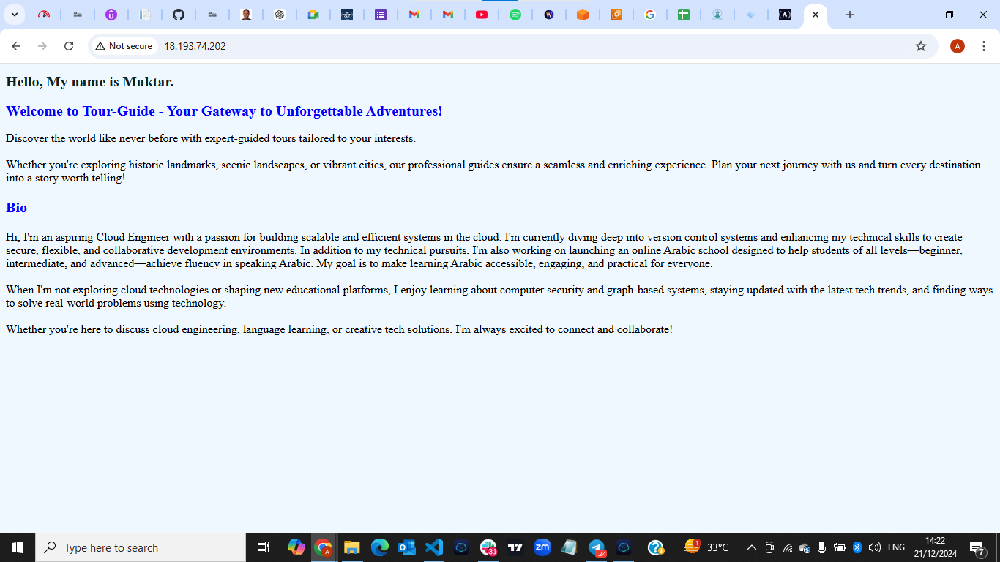

# Web Application Prototype Documentation

## **Project Overview**
Imagine you are part of a startup team tasked with creating a prototype for a web application. Your first step is to provision a server and set up a simple landing page to demonstrate your team’s capabilities to potential investors. This document provides step-by-step instructions for provisioning the server, setting up a web server, deploying an HTML page, and configuring networking.

---

## **1. Provisioning the Server**

### **Step 1: Set Up an EC2 Instance on AWS**
1. Log in to your AWS Management Console.
2. Navigate to the **EC2 Dashboard**.
3. Click **Launch Instance**.
4. Choose an Amazon Machine Image (AMI): Select **Ubuntu Server 22.04 LTS**.
5. Select an instance type: Choose **t2.micro** (free tier eligible).
6. Configure instance details and add storage (default settings are fine).
7. Configure a security group:
   - Add a rule to allow **HTTP (port 80)** traffic.
   - Add another rule to allow **SSH (port 22)** for remote access.
8. Review and launch the instance.
9. Download the **key pair (.pem file)** and keep it secure for SSH access.

### **Step 2: Connect to the Instance**
1. Open a terminal.
2. Use the following SSH command to connect to the instance:
   ```bash
   ssh -i /path/to/key.pem ubuntu@<instance-public-ip>
   ```
3. Replace `<instance-public-ip>` with your EC2 instance's public IP address.

---

## **2. Web Server Setup**

### **Step 1: Update and Install Nginx**
1. Update the package list:
   ```bash
   sudo apt update
   sudo apt upgrade 
   ```
2. Install Nginx:
   ```bash
   sudo apt install nginx 
   ```
3. Start Nginx:
   ```bash
   sudo systemctl start nginx
   ```
4. Verify Nginx is running:
   ```bash
   sudo systemctl status nginx
   ```

---
### **Step 2: Configure Nginx to Serve the HTML File**
1. Edit the Nginx configuration:
   ```bash
   sudo nano /etc/nginx/sites-available/default
   ```
2. Update the `root` directive to point to your directory:
   ```
   root /home/ubuntu/Muktar_Exam;
   index index.html;
   ```
3. Test the configuration:
   ```bash
   sudo nginx -t
   ```
4. Reload Nginx:
   ```bash
   sudo systemctl reload nginx
   ```

---

## **3. HTML Page Deployment**

### **Step 1: Open VS Code**  
- Launch **Visual Studio Code** on your computer.  
- If you don’t have it installed, download it from [here](https://code.visualstudio.com/) and install it.  

---

### **Step 2: Create a New File**  
1. Click on **File** in the top menu.  
2. Select **New File**.  

---

### **Step 3: Save the File with .html Extension**  
1. Go to **File** → **Save As**.  
2. Name your file (e.g., `index.html`).  
3. Make sure to select a folder where you want to save it.  
4. Click **Save**.  

---

### **Step 4: Add HTML Content**  
1. Write your code.
   
2. Save the changes by pressing **CTRL + S** (Windows) or **CMD + S** (Mac).  

---

### **Step 5: Preview Your HTML File in a Browser**  
1. Right-click anywhere inside the HTML file.  
2. Select **Open with Live Server** (if you have the **Live Server** extension installed).  

   **OR**  

- If you don’t have Live Server:  
  1. Go to the folder where you saved the file.  
  2. Double-click on the file to open it in your default web browser.  

---


## **4. Networking Configuration**

### **Step 1: Update Security Groups**
1. Go to the AWS **EC2 Dashboard**.
2. Select your instance and click on **Security Groups**.
3. Ensure the following inbound rules are added:
   - **HTTP (Port 80)**: Open to **0.0.0.0/0** (anywhere).
   - **SSH (Port 22)**: Open to your IP address.

---

## **5. Deliverables**

### **Public IP Address or URL**
- Access your landing page using the following URL:
  ```
  http://63.177.108.148
  ```

### **Screenshot**
- My Landing Page:
  

---

## **6. Troubleshooting**
- **404 Not Found Error:**
  Ensure Nginx has permission to read the directory:
  ```bash
  sudo chmod 755 /home/ubuntu/Muktar_Exam/
  sudo chown -R www-data:www-data /home/ubuntu/Muktar_Exam/
  ```
- **Permission Denied Error:**
  Check logs for more details:
  ```bash
  sudo tail -f /var/log/nginx/error.log
  ```

---

## **Conclusion**
You have now successfully set up and deployed a prototype web application on AWS EC2. This setup demonstrates basic web server configuration, HTML deployment, and network configuration to make your application accessible online.

